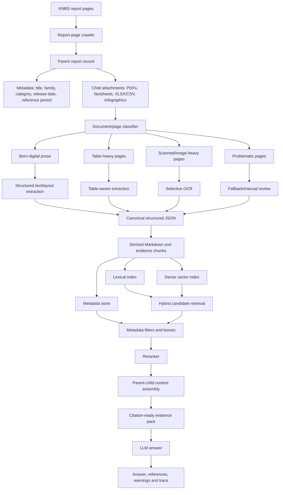
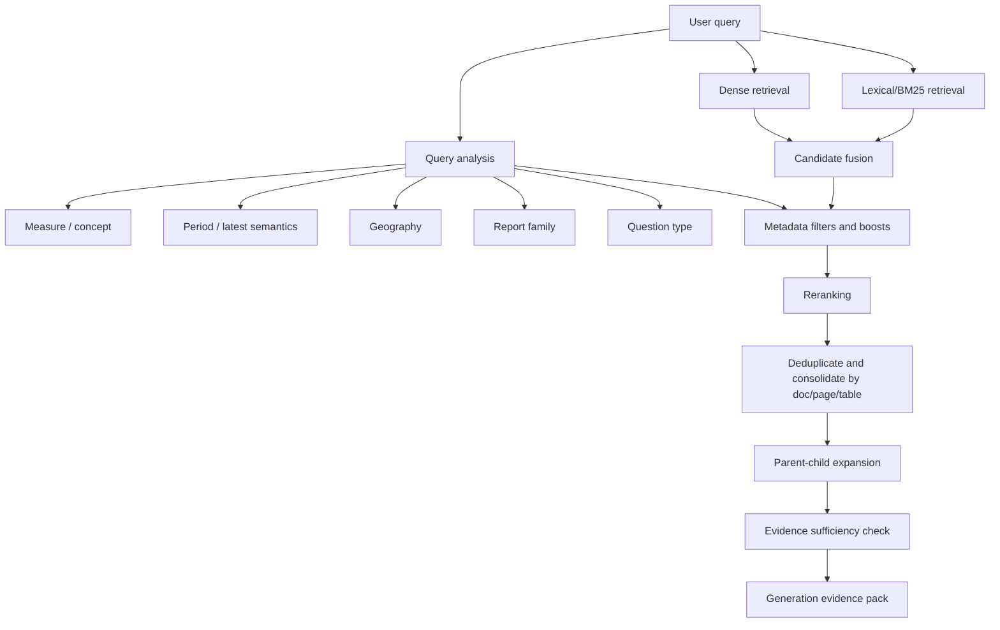

# StatsChat-KE: detailed rationale and research notes

> **How to use this file in the repository**
> This is the long-form background note behind the shorter files in `docs/future-development/`. It consolidates earlier research, course-derived recommendations, repo review and tool-selection thinking. It is useful when maintainers want the detailed rationale, trade-offs and wider evidence base.
>
> Most readers should **not** start here. Start with [`../README.md`](../README.md) and [`../00-recommendations-overview.md`](../00-recommendations-overview.md). The immediate practical priority is the Docling trial described in [`../01b-docling-trial-for-ingestion.md`](../01b-docling-trial-for-ingestion.md).
>
> If this file feels more ambitious than the shorter workstream notes, treat the shorter notes as the current implementation guide. This file explains the wider direction and possible later work, not a requirement to change everything at once.

## Purpose of this document

This document is a handover-style technical roadmap for the next team continuing **StatsChat-KE**, a Retrieval-Augmented Generation (RAG) system that answers natural-language questions using Kenya National Bureau of Statistics (KNBS) publications.

The main focus remains the two highest-impact improvement areas:

1. **PDF processing / ingestion**: turning KNBS PDF reports into structured, retrievable, citable evidence.
2. **Retrieval and ranking**: finding the correct document, page, table, period and source evidence before generation.

The course recommendations reinforce the same conclusion: generation, embeddings, vector stores, UI and evaluation all matter, but they should be designed around the quality of the **evidence chain**. A better LLM or embedding model will not reliably fix missing table structure, poor date metadata, weak chunking, or retrieval that selects the wrong edition of a report.

## Executive summary

**Immediate first priority:** trial Docling as a structured PDF-to-JSON/Markdown converter on a representative KNBS sample set, compare it with the current parser, and only then decide whether to migrate, use it selectively, or keep the current approach. Retrieval, generation and evaluation recommendations should support this first experiment rather than distract from it.

StatsChat should be treated as an **evidence workflow for official statistics**, not just as a chatbot over PDFs. Its job is to help users move from a real-world statistical question to official KNBS evidence, then produce a grounded answer with traceable sources.

The recommended direction is:

1. Reframe the system around **questions about Kenya, grounded in KNBS evidence**.
2. Make the operational split explicit:
   - **prepare once**: crawl, process PDFs, create structured evidence, chunk, embed and index;
   - **answer each question**: interpret the query, retrieve and rerank evidence, generate a grounded answer and return references.
3. Move from PDF-to-text extraction to **structured document conversion**.
4. Store **canonical JSON** as the durable ingestion output, with derived Markdown and retrieval chunks generated from that JSON.
5. Preserve tables, headings, captions, units, footnotes, dates, page numbers and reference periods as first-class evidence metadata.
6. Treat the current retrieval stack as a strong baseline, then test **hybrid search** and metadata-aware retrieval as measured experiments rather than assumed replacements.
7. Improve metadata-aware retrieval using fields produced by structured ingestion: report family, geography, publication date, reference period, page, table and evidence type.
8. Preserve reranking and make reranker behaviour more inspectable.
9. Treat chunks as **evidence units**, not arbitrary blocks of text.
10. Strengthen generation by passing compact evidence packs and requiring period, geography, unit, citation and evidence sufficiency checks.
11. Expand evaluation so that failures are labelled by stage: ingestion, chunking, retrieval, wrong edition, generation, citation, evaluator issue, or insufficient-evidence handling.
12. Introduce explicit readiness criteria before wider rollout.

The key practical recommendation is now staged:

1. First, run a **small PDF-processing trial** on representative KNBS documents and known failure cases, comparing the current parser with Docling and Docling plus light StatsChat-specific post-processing.
2. If that improves evidence quality, re-index a small test corpus from the new structured output and compare retrieval/answer quality.
3. Only after this ingestion baseline is clearer, run a **retrieval bake-off** comparing the current retrieval stack with selected alternatives such as hybrid lexical+dense retrieval, stronger metadata filtering, or different reranking settings.

The possible longer-term target architecture, after the Docling/structured-ingestion trial has been evaluated, is:

- **PDF processing**: make the immediate priority a Docling trial, benchmarked against the current PyMuPDF/`pdfplumber` pipeline; use Docling JSON as candidate canonical output and derived Markdown for inspection/LLM context; add a thin StatsChat-specific post-processing layer for KNBS metadata, table evidence, page citations, stable IDs and quality flags; keep Marker and hosted tools as comparison/fallback candidates rather than first-step defaults.
- **Ingestion output**: canonical structured JSON plus derived Markdown and chunk renderings.
- **Chunking**: evidence-unit and parent-child chunking, with table-aware chunks and stable IDs.
- **Retrieval, as a later experiment rather than the first priority**: keep the current retrieval stack as the baseline, then test hybrid lexical + dense search, stronger metadata filters/boosts, candidate fusion, reranking settings, table-aware retrieval and dedicated handling for “latest” questions.
- **Generation**: compact evidence packs, strict statistical extraction rules, structured output and standard refusal behaviour.
- **Evaluation**: stage-specific metrics, benchmark versioning, failure labels, real-user pilot questions and readiness gates.

## Current working assumptions

These assumptions are based on the previous research, project context and the course recommendation memos.

- The corpus is approximately **1,000 KNBS PDFs**, growing slowly at around **1–2 reports per month**.
- The source material is public KNBS publication content, so privacy/security and local LLM hosting are not the focus of this document.
- Cloud-hosted LLM APIs are the intended deployment route.
- Latency is already acceptable in cloud mode; the priority is **answer quality, evidence quality and correct supporting documents**.
- KNBS reports include clean born-digital PDFs, table-heavy annual reports, monthly releases, county-level reports, chart-heavy documents and some scanned/problematic PDFs.
- The existing Python codebase and tests should be reused where useful, but the next team should be prepared to replace individual pipeline components where evaluation justifies it.
- The current system should be described as a **useful and improving prototype**, not as an unrestricted public production service.

## Core framing: StatsChat as an evidence workflow

A recurring course theme was that StatsChat is easiest to improve when it is framed as an evidence workflow rather than an AI answer box.

Recommended product definition:

> **StatsChat helps users answer questions about Kenya and Kenyan statistics by finding relevant KNBS evidence and using it to generate a grounded answer.**

This framing matters because users are usually not asking “which PDF contains this phrase?” They are asking for a statistic, definition, caveat, comparison or source. The system should therefore help them check:

- **Definition**: is the statistical concept being used correctly?
- **Date / period**: is the publication date or reference period correct?
- **Source**: is the answer supported by official KNBS evidence?
- **Caveats**: has the system preserved relevant footnotes, limitations or context?

### Prepare-once vs answer-each-question

The documentation, repo structure, logs and UI should distinguish the two halves of the RAG system:

| Activity | Prepare once / on update | Per question | Why it matters |
|---|---:|---:|---|
| Crawl report pages | Yes | No | Determines corpus coverage and source metadata. |
| Download PDFs and attachments | Yes | No | Missing attachments cannot be recovered at query time. |
| Convert PDFs to structured JSON | Yes | No | Preserves evidence, pages, tables and metadata. |
| Chunk and embed | Yes | No | Determines what retrieval can find. |
| Query analysis | No | Yes | Determines intended measure, date, geography and ambiguity. |
| Retrieve/rerank evidence | No | Yes | Determines whether the LLM sees the right material. |
| Generate answer | No | Yes | Turns selected evidence into a response. |
| Evaluate and inspect traces | Both | Both | Helps assign failures to the right stage. |

## Why PDF processing and retrieval must be designed together

StatsChat’s answer quality depends on a chain:

1. The right report page and attachments are captured.
2. The right PDF pages, tables, charts and sections are extracted.
3. The extracted content preserves page numbers, headings, table structure, units, dates, geography and caveats.
4. Chunking keeps evidence together rather than splitting values away from context.
5. The index stores both semantic text and exact metadata.
6. Retrieval finds the correct document, edition, page/table and evidence span.
7. Reranking selects the strongest evidence.
8. Generation receives enough context to answer, but not so much that the model is distracted by noise.

Retrieval is the right conceptual starting point because it defines what evidence the LLM needs. But PDF ingestion is likely the practical limiting factor: once tables, page numbers, units or dates are lost, no embedding model or reranker can reliably restore them.

## Recommended target architecture



## Workstream 0: product contract, traceability and readiness

These are not the main technical workstreams, but they make PDF-processing and retrieval improvements easier to test, explain and hand over.

### 0.1 Define the user-facing answer contract

The API/UI response should separate the answer, evidence, warnings and debug fields. A suggested schema is:

```json
{
  "question": "...",
  "answer": "...",
  "answer_status": "answered | insufficient_evidence | ambiguous | error",
  "assumptions": ["..."],
  "warnings": ["..."],
  "references": [
    {
      "publication_title": "...",
      "report_family": "...",
      "publication_date": "...",
      "reference_period": "...",
      "page": 0,
      "section": "...",
      "table_id": "...",
      "evidence_type": "prose | table | figure | page_anchor",
      "evidence_preview": "...",
      "retrieval_score": 0.23,
      "rerank_score": 0.91
    }
  ],
  "debug": {
    "model": "...",
    "prompt_version": "...",
    "index_version": "...",
    "retrieval_config": "..."
  }
}
```

User-facing fields should be concise. Maintainer/evaluator fields should be available in a trace view, not necessarily shown to all users.

### 0.2 Add a trust-check experience

The UI should make it easy for users to inspect:

- the direct answer;
- the publication title;
- page/table/section;
- reference period;
- retrieved extract;
- warnings or assumptions;
- whether the system had enough evidence.

A simple panel could say:

> Before using this answer, check the definition, date, source and caveats.

This is important for official statistics because a fluent answer with the wrong period or unsupported source is high risk even if it sounds plausible.

### 0.3 Add lightweight ambiguity handling

Some questions should trigger clarification or assumption statements, especially those using terms like “latest”, “current”, “growth”, “inflation”, “employment”, “county”, “rate” or “driven by”.

Recommended behaviour:

- If the ambiguity is minor and evidence is strong, answer with an explicit assumption.
- If the ambiguity materially changes the answer, ask a clarification question or return `answer_status: ambiguous`.
- Always state whether “latest” was interpreted as latest publication, latest reference period, or latest available value.

### 0.4 Define readiness gates

Before wider rollout, define minimum readiness criteria, for example:

- document recall threshold on benchmark questions;
- page/table recall threshold for table-heavy questions;
- latest-period accuracy threshold;
- citation support threshold;
- refusal accuracy threshold;
- extraction quality threshold for new ingestion runs;
- known limits documented in the UI and README.

## Workstream 1: PDF processing and ingestion

### Core recommendation

Move from plain page-text extraction toward **structure-preserving document conversion**, with the immediate practical priority being a **Docling-to-JSON/Markdown trial**.

The output should not be only text chunks. It should be a structured representation containing pages, headings, paragraphs, tables, figures, captions, units, footnotes, source notes, reference periods and extraction-quality flags.

The ingestion goal should be:

> Convert statistical PDFs into structured, retrievable, citable evidence for a RAG system.

### 1.1 Treat KNBS report pages as parent records

The ingestion unit should be the KNBS report page, not only the PDF file. A report page may contain:

- primary PDF;
- popular version or abridged PDF;
- factsheet or infographic;
- spreadsheet downloads;
- report title, category and page text;
- release date and possibly reference period.

Recommended parent-child model:

```text
Report page
├── report metadata
├── primary PDF
├── popular/abridged version, if available
├── factsheet/infographic, if available
├── XLSX/CSV/table downloads, if available
└── extracted evidence objects from each attachment
```

This supports source traceability, deduplication, report-family retrieval and future non-PDF sources.

### 1.2 Use canonical JSON plus derived Markdown

StatsChat should produce **canonical JSON** as the durable ingestion output and derive Markdown from that JSON for human inspection, retrieval rendering and LLM context.

The JSON should include:

- source URLs and attachment metadata;
- title, category, report family, release date and reference period;
- page numbers and, where possible, bounding boxes;
- headings and section hierarchy;
- paragraphs;
- tables with captions, headers, row labels, units and footnotes;
- figures and captions;
- extraction method, parser version and configuration hash;
- quality flags and warnings;
- stable document/page/chunk IDs;
- links to neighbouring chunks and parent evidence.

Markdown is useful, but it should be generated from the canonical JSON. Visually clean Markdown is not enough if it cannot support page citations, table fidelity, index versioning and evaluation.

### 1.3 Preserve tables as first-class evidence objects

Many KNBS answers are in tables. Tables should not be flattened into ambiguous prose without retaining their structure.

For each table, preserve:

- table ID;
- page range;
- caption/title;
- heading path;
- column headers;
- row labels;
- units;
- footnotes/source notes;
- surrounding prose;
- machine-readable representation such as CSV/JSON;
- Markdown/HTML rendering for LLM context.

Table chunks should keep the value with its row label, column header, unit, period and source note. For long tables, consider row-window chunks linked to the full parent table.

### 1.4 Classify pages and route extraction methods

Do not use one extraction method blindly on every page. Add page-level or document-level classification:

| Page/document type | Recommended handling |
|---|---|
| Born-digital prose | Fast native/layout extraction. |
| Born-digital table-heavy page | Native extraction plus table-specific parser. |
| Scanned page | OCR first, then structural extraction. |
| Mixed/image-heavy page | Selective OCR only where text layer is weak. |
| Problematic page | Fallback parser or manual review queue. |

Selective OCR should be used where needed, not globally. Native text extraction is usually better for clean born-digital PDFs.

### 1.5 Add extraction-quality flags and review queues

Each ingestion run should produce a quality report. Track:

- pages with no/low text;
- high OCR dependency;
- table-like pages where no table was extracted;
- unusually high/low chunk counts;
- missing title/date/page metadata;
- repeated header/footer contamination;
- extraction exceptions;
- pages placed into a fallback/manual review queue.

This turns ingestion failures into visible maintenance tasks rather than hidden retrieval failures.

### 1.6 Candidate tools and recommended roles

The next team should not try to redesign every ingestion component at once. Start with a narrow, evidence-led trial:

```text
current parser baseline
vs
Docling
vs
Docling + StatsChat-specific post-processing
```

Docling is the recommended first candidate because it is open source, locally runnable, designed for document conversion/RAG-style workflows, supports PDF input, and can export both Markdown and lossless JSON. However, it should not be treated as a magic black box: KNBS-specific post-processing is still needed for metadata, tables, reference periods, stable IDs, citations and quality flags.

Recommended roles:

| Role | Tool / approach | Recommended use |
|---|---|---|
| Baseline to beat | Current parser / PyMuPDF / PyMuPDF4LLM | Keep as current low-disruption baseline and possible fallback. |
| First structured-conversion trial | Docling | Recommended first candidate for structured JSON/Markdown conversion and RAG-oriented document processing. |
| Comparison candidate if needed | Marker | Serious comparison option for Markdown, JSON, chunk and HTML outputs, but not required before the first Docling trial. |
| General ingestion framework | Unstructured | Useful comparator for element-level document objects. |
| Table-specific fallback | pdfplumber / Camelot / Tabula | Use on recurring table layouts or table repair, not as whole pipeline. |
| Scan preprocessing | OCRmyPDF + Tesseract | Apply selectively to scanned/problematic pages. |
| Hosted RAG/OCR benchmark | LlamaParse / Mistral OCR | Benchmark or fallback for complex/scanned documents. |
| Enterprise/cloud benchmark | Azure AI Document Intelligence / Google Document AI | Benchmark or production option if procurement/platform alignment supports it. |
| Human QA/exploration | NotebookLM | Use for inspection and SME comparison only, not production ingestion. |
| Long-term research | LayoutLMv3 / Donut / docTR | Consider only if standard tools fail on major recurring document classes. |

### 1.7 PDF-processing trial and bake-off

Start small: use 15–25 representative documents/pages for the first Docling trial. Expand to 20–50 if results are promising or if parser choice remains unclear.

Include:

- clean born-digital PDFs;
- CPI/monthly releases;
- Economic Surveys and Statistical Abstracts;
- county abstracts;
- chart-heavy pages;
- scanned/problematic PDFs;
- known benchmark failures.

Score each parser on:

- reading order;
- heading preservation;
- page-number accuracy;
- table detection;
- table fidelity: headers, rows, columns, units, footnotes;
- cross-page table handling;
- figure/caption extraction;
- header/footer removal;
- Markdown readability;
- JSON usefulness;
- chunkability;
- extraction warnings/errors;
- speed/cost/reproducibility;
- downstream retrieval and answer impact on benchmark questions.

Diagnostic questions should include:

- Was the relevant CPI/GDP/population value preserved exactly?
- Was the table title attached to the right table?
- Were row labels, column headers and units preserved together?
- Can the extracted output support the verified benchmark answer?
- Can the output identify the source document, page and table?

## Workstream 2: splitting, chunking, embedding and indexing

### Core recommendation

Treat chunks as **evidence units**, not arbitrary text fragments. Chunking should be designed around the evidence the LLM needs to answer: a paragraph, definition, table, table row-window, figure caption, source note or page anchor.

### 2.1 Chunk types

Recommended chunk types:

| Chunk type | Purpose |
|---|---|
| Prose-section chunk | Definitions, methodology, caveats and short textual answers. |
| Table chunk | Numeric/statistical lookup, preserving caption, headers, units and notes. |
| Row-window chunk | Retrieval precision for large tables, linked to the parent table. |
| Figure/caption chunk | Chart-heavy pages and figure descriptions. |
| Footnote/source-note chunk | Caveats and interpretation limits. |
| Page anchor | Page-level citation and neighbouring-context expansion. |

### 2.2 Parent-child retrieval

Use small-to-big retrieval:

1. Index smaller child chunks for precision.
2. Retrieve the best child chunks.
3. Expand to the parent section, full table, page window or neighbouring chunks for generation.

This helps avoid two common failures:

- small chunks retrieve a value without the unit, table title or footnote;
- large chunks include too much noise and reduce retrieval precision.

### 2.3 Stable IDs and index versioning

Every evidence object should have a stable ID, such as:

```text
knbs:<report-slug>:<attachment-id>:page-<n>:<element-type>-<element-id>
```

Track:

- source document/version;
- extraction tool and version;
- chunking config;
- embedding model;
- index build timestamp;
- benchmark run ID.

This is essential for reproducibility, rollback and evaluation comparisons.

### 2.4 Metadata inside and beside chunks

Metadata should be stored as structured fields, but key metadata should also be included in the text that is embedded and indexed lexically. For example:

```text
Publication: 2026 Economic Survey
Report family: Economic Survey
Reference period: 2025
Page: 42
Section: Gross Domestic Product
Table: Real GDP growth by sector
Unit: percent
Content: ...
```

This can improve dense retrieval because embedding models often perform better when titles, headings, dates and units are included in the embedded text.

### 2.5 Benchmark chunk size and overlap

Do not choose `split_length`, overlap or chunk boundaries by intuition. Run chunking experiments such as:

- current page/character chunks;
- section-aware chunks;
- table-first chunks;
- row-window plus parent-table chunks;
- different overlaps;
- adjacent-context expansion.

Measure retrieval and final answer impact, especially for table-heavy and latest-period questions.

### 2.6 Embeddings

Embedding choice should come after evidence structure and retrieval design. Candidate comparisons:

| Model | Recommended role |
|---|---|
| Current all-mpnet-base-v2-style baseline | Keep as baseline and regression comparator. |
| multilingual-e5-large / instruct variant | Strong open-source retrieval candidate. |
| BGE-M3 | Strategic candidate because it supports dense/sparse/multi-vector capabilities. |
| OpenAI text-embedding-3-large | Strong cloud comparator if cloud APIs are acceptable. |

Confirm and document:

- the model used for indexing;
- the model used for query embedding;
- whether vectors are normalised;
- which distance metric is used;
- whether score semantics mean higher-is-better or lower-is-better.

### 2.7 Vector stores

At the current corpus size, choose a store for retrieval features and maintainability, not scale.

| Store | Fit |
|---|---|
| FAISS/current stack | Good short-term baseline, but hybrid search and metadata logic need to be added around it. |
| Qdrant | Strong balanced medium-term option for vector search, payload filters and hybrid/multi-stage retrieval. |
| OpenSearch | Strong lexical/hybrid search and explainability, but heavier. |
| pgvector | Useful if relational metadata joins dominate. |
| Weaviate/Pinecone/Milvus | Capable, but may be more platform than needed unless operational requirements justify them. |

## Workstream 3: retrieval and ranking

### Core recommendation

Move from dense-only retrieval to a **hybrid, metadata-aware, reranked retrieval pipeline**. Official statistics queries often depend on exact terms, dates, units, counties, report names, table titles and reference periods. Dense similarity is useful, but it should not be the only retrieval signal.

### 3.1 Retrieval flow



### 3.2 Hybrid first-stage retrieval

A starting experimental configuration:

- lexical/BM25 top 40;
- dense top 40;
- fuse with Reciprocal Rank Fusion or normalised score fusion;
- deduplicate to 50–60 candidates;
- apply metadata boosts/filters;
- rerank top 20–30;
- pass 4–8 evidence items to generation.

Tune these values using retrieval evaluation. Do not hard-code them as permanent rules.

### 3.3 Metadata-aware retrieval

Metadata should support both filters and boosts:

- report family;
- publication title;
- release date;
- reference period start/end;
- geography;
- evidence type;
- page number;
- table ID/title;
- units;
- extraction-quality flags;
- document version/deduplication status.

Examples:

- CPI query → boost CPI report family and exact month/reference period.
- County question → boost matching county name and county abstract/report family where relevant.
- Latest query → sort/boost by reference period, not just upload or release date.
- Table lookup → boost table captions, headers and units.

### 3.4 Handling “latest”

“Latest” should not be handled as ordinary semantic similarity. The system should distinguish:

- latest uploaded publication;
- latest publication in a report family;
- latest reference period;
- latest data point for a measure/geography;
- latest value across a recurring table series.

Recommended logic:

1. Infer candidate report family/families.
2. Infer measure and geography.
3. Search recent editions within the family.
4. Use exact period match if a period is specified.
5. For “latest”, prioritise `reference_period_end`.
6. Use `release_date` as a tie-breaker.
7. Include the interpreted period in the final answer or warning.

### 3.5 Reranking

Add a second-stage reranker after broad candidate retrieval. Options include:

- local Sentence Transformers cross-encoders;
- hosted rerankers such as Cohere Rerank;
- later multi-vector or ColBERT-style retrieval if simpler reranking is insufficient.

The reranker should be inspectable. Logs should show:

- first-stage dense score;
- first-stage lexical score;
- metadata boosts;
- fused rank;
- rerank score;
- final inclusion/exclusion decision.

### 3.6 Query rewriting and multi-query retrieval

For difficult questions, add lightweight query rewriting or multi-query retrieval. Examples:

- rewrite “inflation” to include “CPI”, “consumer price index”, “annual inflation”, “year-on-year”;
- rewrite “real GDP growth” to include “GDP at constant prices” and “real gross domestic product”;
- expand abbreviations and official terminology;
- generate separate subqueries for measure, period and geography.

This should be evaluated carefully, because query rewriting can also broaden retrieval too much.

### 3.7 Weak-evidence and no-answer retrieval behaviour

Separate two concepts:

1. **Possibly relevant documents found**.
2. **Evidence strong enough to generate an answer**.

The system may show possibly relevant documents while refusing to answer. Suggested statuses:

- `answered`;
- `insufficient_evidence`;
- `ambiguous`;
- `out_of_scope`;
- `future_or_unpublished_data`;
- `retrieval_failed`.

### 3.8 Score semantics and k parameters

Document and standardise:

- what each score means;
- whether lower or higher is better;
- which thresholds apply at document, chunk, rerank and answer stages;
- the difference between `k_docs`, `k_contexts`, candidate pool size and final evidence count.

Avoid presenting low-level vector distances to users unless they are clearly explained in a debug view.

### 3.9 Deduplication and canonicalisation

Add deduplication for:

- duplicate PDFs;
- same report with URL/date prefixes;
- popular/abridged versions vs primary publications;
- repeated pages/chunks;
- updated editions of the same recurring report.

Canonical document IDs and versioning are important for retrieval evaluation and “latest” handling.

## Workstream 4: generation and evidence packaging

Generation is not the main focus, but the generation layer should reinforce the evidence-first design.

### 4.1 Pass compact citation-ready evidence packs

Do not pass anonymous text blobs. Pass structured evidence items containing:

- publication title;
- report family;
- release date;
- reference period;
- page/table/section;
- geography;
- unit;
- evidence type;
- extracted text or serialized table;
- retrieval/rerank metadata if useful;
- extraction warnings if relevant.

Default target: pass **4–8 high-quality evidence items**, not a large dump of loosely related text.

### 4.2 Statistical extraction prompt rules

The generation prompt should explicitly instruct the model to match:

- period;
- geography;
- measure;
- unit;
- requested operation: lookup, definition, comparison, trend, caveat or summary.

It should tell the model not to use:

- comparison figures as headline answers unless asked;
- previous-year values when current-period values are requested;
- component figures when totals are requested;
- causal or policy claims unless directly supported;
- unsupported forecasts or advice.

Suggested prompt fragment:

```text
When answering statistical questions:
- Match the period, geography, measure and unit requested in the question.
- If several figures appear, choose the one that directly answers the question.
- Do not use comparison figures such as “compared with...” as the answer unless the user asks for the comparison.
- Do not infer causes, policy implications or forecasts unless the provided evidence directly states them.
- Include the period and unit in the answer.
- Cite the publication, page and table where available.
```

### 4.3 Standardise refusal and weak-evidence responses

Add standard templates for:

- no relevant evidence;
- potentially relevant documents but insufficient evidence;
- ambiguous period/measure/geography;
- out-of-scope policy advice;
- future or unpublished data;
- unsupported causal claim.

Suggested structured output:

```json
{
  "answer_provided": false,
  "answer_status": "insufficient_evidence",
  "refusal_reason": "retrieved_context_does_not_contain_requested_statistic",
  "answer": "I found potentially relevant KNBS publications, but the retrieved passages do not provide enough evidence to answer directly.",
  "references": []
}
```

### 4.4 Structured generation output

For evaluation and downstream integration, the LLM should produce or be converted into structured output:

```json
{
  "answer": "...",
  "answer_type": "numeric | textual | comparison | insufficient_evidence",
  "value": "...",
  "unit": "...",
  "period": "...",
  "geography": "...",
  "citations": [
    {
      "publication": "...",
      "page": 0,
      "table_id": "...",
      "supports_claim": true
    }
  ],
  "warnings": [],
  "assumptions": []
}
```

### 4.5 Prompt/version logging

Log:

- model name/version;
- prompt template version;
- generation parameters;
- evidence pack IDs;
- answer status;
- refusal reason;
- citations;
- final rendered answer.

This allows failures to be attributed to retrieval, evidence packaging, model behaviour or prompt changes.

## Workstream 5: evaluation, diagnostics and monitoring

### Core recommendation

Evaluation should be decomposed by pipeline stage. A final answer may be wrong because the evidence was never ingested, the chunk was poorly formed, the retriever chose the wrong edition, the reranker dropped the right table, the generator selected the wrong number, or the evaluator scored incorrectly.

### 5.1 Expand and QA the benchmark

The benchmark should cover:

- straightforward prose lookups;
- definitions and methodology;
- single-table numeric lookup;
- table plus prose interpretation;
- county/geography-specific questions;
- latest-period questions;
- comparison/trend questions;
- chart/figure questions;
- unanswerable and weak-evidence questions;
- out-of-scope/policy-advice questions.

Each benchmark item should include:

```text
query
gold_answer
answer_type
gold_publication
gold_page
gold_table_id
evidence_span_or_object
reference_period
release_date
unit
geography
intent_class
expected_answer_status
failure_notes, if relevant
```

Benchmark QA is a core task. Gold answers should be checked for correct source, period, unit and citation.

### 5.2 Separate evaluation layers

Evaluate separately:

| Layer | Question answered |
|---|---|
| Ingestion evaluation | Did the evidence survive PDF processing? |
| Chunking evaluation | Is the evidence kept with its context? |
| Retrieval evaluation | Did the system retrieve the right document/page/table/evidence? |
| Reranking evaluation | Did reranking promote the best evidence? |
| Generation evaluation | Did the model answer correctly from provided evidence? |
| Citation evaluation | Does the cited evidence support the claim? |
| Refusal evaluation | Did the system answer/refuse appropriately? |
| User trust evaluation | Can users inspect and understand the evidence? |

### 5.3 Recommended metrics

Retrieval metrics:

- Document Hit@1 / Recall@5 / Recall@10;
- Page Hit@k;
- Table Hit@k;
- evidence-span hit;
- Mean Reciprocal Rank;
- wrong-edition rate;
- latest-period accuracy;
- geography accuracy;
- citation-support rate.

Ingestion metrics:

- text extraction success rate;
- empty/low-text page rate;
- OCR rate;
- table detection and table fidelity;
- heading preservation;
- page number preservation;
- date/reference-period parse success;
- quality-flag counts.

Answer metrics:

- numeric exact/normalised match;
- unit correctness;
- period correctness;
- geography correctness;
- grounding accuracy;
- citation correctness;
- abstention precision/recall;
- unsupported-claim rate.

### 5.4 Failure labels

Add systematic failure labels:

| Failure category | Meaning |
|---|---|
| Ingestion failure | Source evidence was missing or corrupted before indexing. |
| Chunking failure | Evidence was split away from needed context. |
| Retrieval failure | Correct document was not retrieved. |
| Wrong-edition failure | Older or wrong edition retrieved. |
| Page/evidence failure | Correct document but wrong page/table/span. |
| Reranking failure | Correct candidate retrieved but demoted. |
| Generation failure | Correct evidence retrieved but answer wrong. |
| Unsupported synthesis | Model adds unsupported explanation. |
| Refusal failure | System answers when it should refuse. |
| Over-refusal | System refuses despite sufficient evidence. |
| Citation failure | Citation does not support the exact claim. |
| Evaluator failure | Scoring logic or gold item is wrong. |

### 5.5 Repeated evaluation and human review

Because LLM outputs can vary, run repeated evaluations after prompt/model changes. Use human review for:

- benchmark QA;
- ambiguous questions;
- citation support;
- table extraction quality;
- internal pilot feedback.

Collect real user questions during internal pilot and add them to the benchmark after review.

### 5.6 Run reports and dashboards

Each benchmark run should output:

- git commit;
- corpus/index version;
- extraction/chunking config;
- embedding model;
- retrieval config;
- reranker config;
- LLM and prompt version;
- overall metrics;
- metrics by question type;
- failure category counts;
- examples of regressions and improvements.

A lightweight Markdown/CSV/HTML run report is enough initially; a dashboard can come later.

## Recommended phased roadmap

### Phase 0: consolidate baseline and benchmark

Outputs:

- current system baseline on benchmark;
- document/page/table gold evidence for key questions;
- failure labels for current errors;
- retrieval score semantics documented;
- `k_docs`, `k_contexts`, candidate pool and final context count documented;
- prototype/readiness caveats updated in README/UI.

### Phase 1: observability quick wins

Implement:

- ingestion run quality report;
- retrieval-only logging;
- maintainer-facing trace view;
- stable chunk/document IDs;
- prompt/index/retrieval version logging;
- metadata completeness report;
- demo/canonical question set.

### Phase 2: Docling trial, target schema and PDF-processing decision

Implement:

- representative sample of 15–25 KNBS PDFs/pages, including known failures;
- parser comparison: current PyMuPDF/`pdfplumber` route vs Docling vs Docling plus light StatsChat post-processing;
- minimal canonical JSON/evidence schema;
- derived Markdown rendering;
- quality flags and fallback routing;
- small re-index and retrieval/answer comparison using the audited benchmark.

Decision point:

- adopt Docling as default, use it selectively as a fallback, or retain the current parser;
- only expand to Marker, Unstructured, hosted benchmarks or table-specific tools if the first trial shows remaining gaps.

### Phase 3: structure-aware chunking and reindexing

Implement:

- evidence-unit chunking;
- table chunks and row-window chunks;
- parent-child retrieval links;
- metadata prefixes in embedded/indexed text;
- chunk-size/overlap experiments;
- adjacent-context expansion;
- full reprocessing and reindexing once schema stabilises.

### Phase 4: hybrid retrieval and reranking

Implement and compare:

1. current dense baseline;
2. lexical/BM25 baseline;
3. hybrid dense + lexical;
4. hybrid + metadata filters/boosts;
5. hybrid + reranking;
6. query rewriting/multi-query retrieval for selected difficult question types;
7. dedicated latest-query path.

Decision point:

- keep current vector store with added lexical/rerank components, or move to Qdrant/OpenSearch/another store if it simplifies the target design.

### Phase 5: generation tightening and evidence packaging

Implement:

- evidence-pack template;
- structured generation output;
- stronger statistical extraction prompt rules;
- standard weak-evidence/refusal templates;
- answer-supported vs possibly-relevant-documents distinction;
- generation-specific evaluation cases.

### Phase 6: internal pilot feedback loop and readiness review

Implement:

- internal user feedback capture;
- curated real-question benchmark additions;
- trust/traceability review;
- readiness gates for wider deployment;
- operational monitoring schedule.

## Suggested immediate next actions

If time before handover is limited, prioritise:

1. **Freeze the benchmark** with gold document/page/table evidence and expected answer status.
2. **Select 15–25 representative PDFs/pages** for a structured extraction trial, including known table, layout, scan and benchmark-failure cases.
3. **Define the minimum canonical evidence schema** needed for the trial: document metadata, page metadata, evidence object type, source URL, page number, Markdown, table JSON where available and quality flags.
4. **Run current parser vs Docling vs Docling plus StatsChat post-processing** and save all outputs for inspection.
5. **Re-index the trial corpus** from the current and Docling-derived outputs, then compare retrieval and answer quality on benchmark questions.
6. **Decide parser status**: default, selective fallback, or not adopted.
7. **Add ingestion and retrieval run reports** so future teams can see where failures occur.
8. **Document “latest” semantics** for CPI, Economic Survey, Statistical Abstract and other key recurring report families.
9. **Prototype hybrid retrieval only after the ingestion trial**, using BM25 + current dense retrieval + simple metadata boosts if the benchmark shows a need.
10. **Create a concise handover pack** with parser decisions, schema, benchmark, run instructions and known failure cases.

## Handover artefacts the next team should receive

- architecture overview showing prepare-once vs per-question stages;
- canonical evidence schema;
- parser/tool decision log;
- extraction tool versions and fallback order;
- representative extracted JSON/Markdown outputs;
- known problematic reports/pages;
- metadata completeness report;
- benchmark dataset and scorer;
- retrieval configuration and score semantics;
- reranker configuration;
- embedding model/index version information;
- generation prompt templates and version history;
- run reports for current baseline and experimental branches;
- readiness criteria;
- internal pilot feedback template;
- rollback instructions for parser, chunker, embedding model and index.

## Main risks and mitigations

| Risk | Why it matters | Mitigation |
|---|---|---|
| Treating PDF parsing as solved by one tool | Even strong parsers fail on some layouts. | Choose a primary tool through bake-off; add fallback routing and quality flags. |
| Visually good Markdown but weak evidence structure | Markdown may look readable while losing table provenance or page references. | Use canonical JSON as source of truth; derive Markdown from JSON. |
| Over-focusing on embeddings | Embeddings cannot recover missing tables, units or dates. | Fix structure, metadata, hybrid retrieval and evaluation first. |
| Dense-only retrieval selects plausible but wrong editions | Official statistics depend on exact period, geography, title and unit. | Add BM25, metadata filters/boosts, latest logic and reranking. |
| Chunking splits values from context | Correct numbers become uncitable or ambiguous. | Use evidence-unit and parent-child chunking. |
| “Latest” answers are outdated or ambiguous | Users may trust a plausible but wrong period. | Store reference periods and implement dedicated latest-query handling. |
| Reranker becomes a black box | Improvements become hard to debug. | Log all retrieval stages and scores. |
| LLM selects wrong number from correct evidence | Statistical reports contain many nearby figures. | Add statistical extraction prompt rules and generation-specific tests. |
| Evaluation does not identify failure stage | Teams may fix the wrong component. | Use stage-specific metrics and failure labels. |
| Prototype appears more reliable than it is | Users may overtrust outputs. | Add prototype/readiness wording, trust checks and citation previews. |

## Consolidated conclusion

The strongest combined recommendation from the research and course material is:

> **StatsChat-KE should evolve from a PDF-text RAG prototype into a structure-aware, evidence-first RAG system for official statistics.**

The next phase should not start with a wholesale rewrite or a single embedding-model swap. It should start with measurement and evidence preservation:

1. define what successful evidence retrieval means;
2. preserve the evidence through structured PDF processing;
3. chunk around statistical evidence units;
4. retrieve using dense, lexical and metadata signals together;
5. rerank and assemble compact evidence packs;
6. require generation to be grounded, cautious and traceable;
7. evaluate each stage separately.

This approach keeps the work practical and handover-friendly. It gives the next team a way to make measurable progress without over-engineering: first improve the evidence objects, then improve retrieval over those objects, then tighten generation and readiness criteria.

## Integration map from course recommendation files

| Source memo | Main contributions incorporated |
|---|---|
| C1 — Overview | Evidence-workflow framing; prepare-once vs per-question split; trust checks; answer contract; ambiguity handling; prototype/readiness language; trace view. |
| C2 — Ingestion and Processing | Parent report records; enriched JSON; tables as first-class evidence; quality flags; fallback extraction; ingestion benchmark; run reports; source traceability. |
| C3 — Splitting, Chunking and Embedding | Evidence-unit chunks; parent-child retrieval; stable IDs; index versioning; metadata prefixes; chunk-size benchmarking; table/context preservation; embedding/metric checks. |
| Retrieval memo | Hybrid retrieval; metadata-aware retrieval; latest/date logic; reranking; query rewriting; score semantics; `k_docs`/`k_contexts`; no-answer behaviour; deduplication. |
| Evaluation memo | Expanded audited benchmark; ingestion/retrieval/generation separation; table extraction evaluation; failure labels; repeated runs; human review; readiness criteria; run reports. |
| Generation memo | Statistical figure-selection prompt rules; refusal templates; answer-supported vs possibly relevant documents; structured output; generation logging; model-agnostic evaluation. |
| PDF-to-JSON/Markdown note | Canonical JSON plus derived Markdown; primary parser bake-off; Docling/Marker emphasis; NotebookLM as QA only; cloud document AI as benchmark/fallback. |

## Source links retained from the two research reports

The two source reports contained deep-research citation markers that do not resolve cleanly outside the original research environment. For portability, this consolidated version removes those inline markers and retains the key source URLs below.

### KNBS corpus and publication structure

- https://www.knbs.or.ke/all-reports/
- https://www.knbs.or.ke/statistical-releases/
- https://www.knbs.or.ke/reports/2024-statistical-abstract/
- https://www.knbs.or.ke/reports/2025-statistical-abstract/
- https://www.knbs.or.ke/reports/2026-economic-survey/
- https://www.knbs.or.ke/reports/consumer-price-indices-and-inflation-rates-march-2026/
- https://www.knbs.or.ke/reports/consumer-price-indices-and-inflation-rates-april-2026/
- https://www.knbs.or.ke/wp-content/uploads/2025/01/ADVANCE-RELEASE-CALENDAR-FY-2024-2025.pdf

### PDF processing and OCR

- https://pymupdf.readthedocs.io/en/latest/recipes-text.html
- https://pymupdf.readthedocs.io/en/latest/pymupdf4llm/
- https://pymupdf.readthedocs.io/en/latest/pymupdf4llm/api.html
- https://docs.unstructured.io/open-source/core-functionality/partitioning
- https://docs.unstructured.io/ui/partitioning
- https://ocrmypdf.readthedocs.io/en/stable/introduction.html
- https://tesseract-ocr.github.io/tessdoc/
- https://pypi.org/project/pdfplumber/
- https://camelot-py.readthedocs.io/
- https://excalibur-py.readthedocs.io/
- https://tabula.technology/
- https://github.com/tabulapdf/tabula
- https://developer.adobe.com/document-services/docs/overview/pdf-extract-api/
- https://www.abbyy.com/vantage/ocr-container/
- https://mindee.github.io/doctr/index.html
- https://grobid.readthedocs.io/en/latest/Principles/

### Additional structured document conversion and cloud benchmarks

- https://docling-project.github.io/docling/
- https://github.com/docling-project/docling
- https://github.com/datalab-to/marker
- https://docs.cloud.llamaindex.ai/llamaparse/getting_started
- https://docs.mistral.ai/capabilities/document_ai/
- https://learn.microsoft.com/en-us/azure/ai-services/document-intelligence/concept-layout
- https://cloud.google.com/document-ai/docs/overview
- https://notebooklm.google/

### Retrieval, reranking, embeddings and vector stores

- https://www.sbert.net/examples/applications/retrieve_rerank/README.html
- https://www.sbert.net/docs/pretrained-models/ce-msmarco.html
- https://docs.cohere.com/v2/docs/rerank
- https://research.google/pubs/reciprocal-rank-fusion-outperforms-condorcet-and-individual-rank-learning-methods/
- https://qdrant.tech/documentation/
- https://qdrant.tech/documentation/search/
- https://qdrant.tech/documentation/search/text-search/
- https://qdrant.tech/documentation/concepts/hybrid-queries/
- https://docs.weaviate.io/weaviate/concepts/search/hybrid-search
- https://docs.weaviate.io/weaviate/search/hybrid
- https://docs.weaviate.io/weaviate/search/rerank
- https://milvus.io/docs/full-text-search.md
- https://docs.pinecone.io/guides/indexes/pods/encode-sparse-vectors
- https://docs.pinecone.io/guides/search/filter-by-metadata
- https://docs.pinecone.io/guides/search/rerank-results
- https://faiss.ai/
- https://huggingface.co/sentence-transformers/all-mpnet-base-v2
- https://huggingface.co/intfloat/multilingual-e5-large
- https://www.microsoft.com/en-us/research/publication/multilingual-e5-text-embeddings-a-technical-report/
- https://huggingface.co/BAAI/bge-m3
- https://huggingface.co/papers/2402.03216
- https://platform.openai.com/docs/guides/embeddings
- https://platform.openai.com/docs/models/text-embedding-3-large
