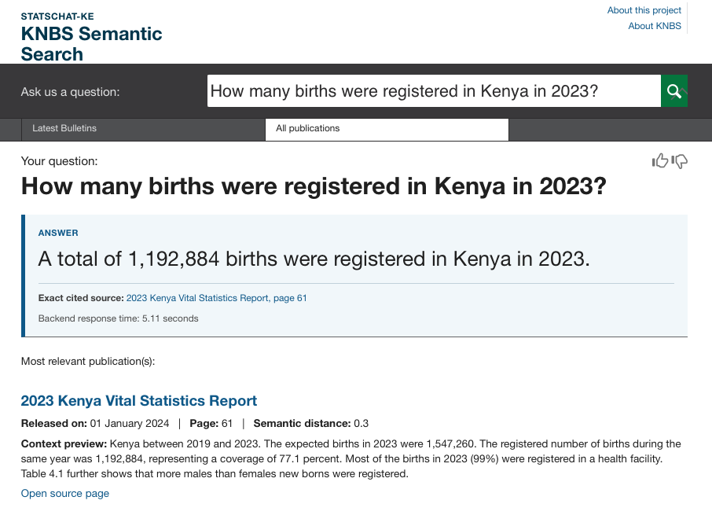

# StatsChat-KE June 2026 Festival Demo Recommendations

Audience: KNBS stakeholders and ONS stakeholders
Status: Internal recommendation note
Date: May 2026

## Recommendation

We recommend demonstrating StatsChat-KE at the June KNBS festival, but presenting it as a guided prototype rather than a public-ready chatbot. The strongest version of the current system is the cloud-backed setup using `openai/gpt-5.4-mini`, and that is the configuration KNBS should use for the session.

This recommendation is different from last year because the tool is now in a much stronger position. The system has been tested against an audited benchmark, the best cloud configuration is reproducible, and the demo can now show not only an answer but also the supporting source and cited page. That makes the tool much easier to explain and defend in front of a mixed KNBS and ONS audience.

## How It Should Be Presented

StatsChat-KE should be described as a grounded question-answering assistant for KNBS publications. It is best understood as a prototype or pilot tool for finding factual answers in indexed reports, not as a general-purpose chatbot. It should not be framed as a policy advice tool, a source of official interpretation without human review, or a fully open public service.

The strongest live demo setup is the cloud API with `gpt-5.4-mini`, shown through the Flask browser interface if it is available for the session. The Flask interface is easier for an audience to follow than Swagger or terminal output because it presents the answer, the cited source, and the supporting publication more clearly. The local LLM should not be used for the festival demo. That was a major reason the earlier demonstration felt slow and unreliable.

The screenshot below shows the preferred demo pattern: a factual question, a concise answer, an exact cited source, and the supporting publication context visible on the same page.

## Best Audience and Best Use

At its current maturity, the tool is best suited to guided stakeholder use: KNBS staff, ONS staff, analysts, and moderated small-group demonstrations. It is not yet best suited to unrestricted public self-service use.

The system works best when questions are factual, clearly phrased, and grounded in KNBS publications. It is strongest on queries asking for figures, rates, totals, dates, or other directly reported statistics. It is weaker, or should refuse to answer, when questions ask for policy advice, personal or governance information, or material outside the indexed KNBS publication set.

Examples of strong demo questions:

- What is the consumer price index inflation rate in February 2025?
- What was Kenya's inflation rate in April 2025?
- How many births were registered in Kenya in 2023?
- What was Kenya's year on year inflation rate in January 2024?

Examples of questions the tool should not be relied upon to answer:

- Should Kenya reduce interest rates to control inflation?
- What is the salary of the KNBS Director General?

## Suggested Demo Format

The KNBS presenter should begin with two or three pre-tested factual questions and use those to show the answer, the cited source, and the supporting page. If audience questions are invited, they should be moderated and limited. A refusal on an unsupported question should be framed as a positive guardrail rather than as a failure, because the correct behaviour for some questions is not to invent an answer.

The key message for the session is that StatsChat-KE is designed for grounded retrieval from KNBS publications. It is already useful in that bounded setting, but it should still be used with human judgement, especially for edge cases.

## Suggested Statement for the Session

The presenter can say something close to the following:

> StatsChat-KE is a prototype assistant designed to answer factual questions grounded in KNBS publications. It works best when the answer is contained in the indexed reports and should not be treated as a general-purpose chatbot or a source of policy advice. Outputs should still be reviewed by a human, especially for edge cases.

## Practical Safeguards

Before the session, the KNBS team should keep the cloud model fixed on `gpt-5.4-mini`, confirm the API is healthy, pre-test the exact demo questions, and prepare fallback screenshots or saved outputs. During the session, the presenter should stay on the Flask browser demo if it is available and avoid ad hoc technical exploration of the backend.

## Bottom Line

KNBS should present the tool, but in a controlled way: as a guided prototype, using the cloud setup, using `gpt-5.4-mini`, and preferably using the Flask browser demo interface. That approach gives the best chance of a credible and useful demonstration while remaining honest about the current maturity and limits of the system.
